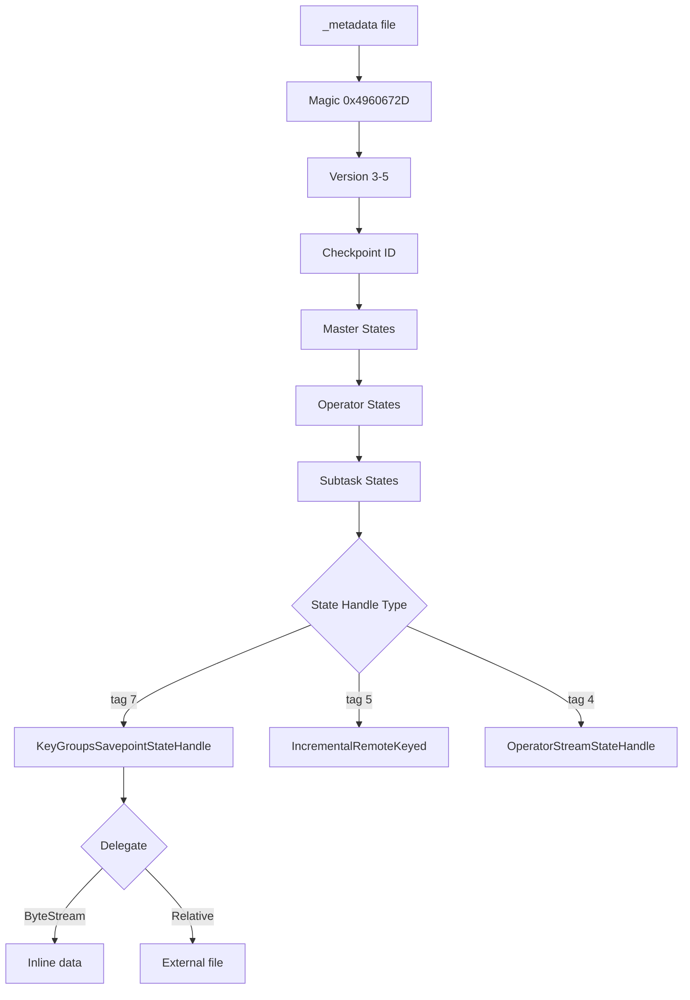
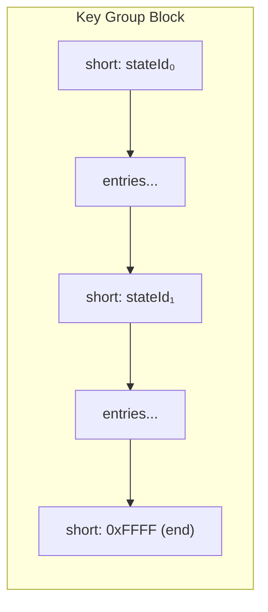
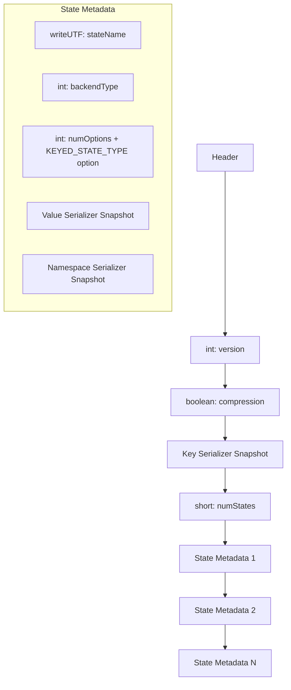
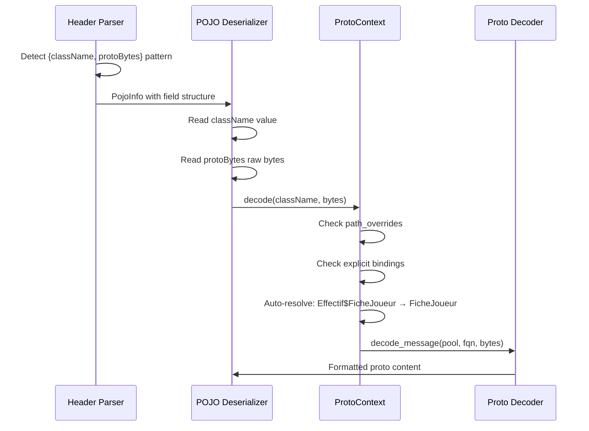

# Flink Savepoint Binary Format

> Reverse-engineered from Flink 1.20 source code and validated against real savepoints.
> This document covers the **canonical savepoint format** (heap backend).
> See also: [magic-numbers.md](magic-numbers.md) for a complete reference of all constants.

## Overview

A Flink savepoint directory contains:

```
savepoint-<id>/
├── _metadata          # Binary metadata file (operator graph + state handles)
├── <uuid-1>           # External state data file (Relative handles)
├── <uuid-2>
└── ...
```



## _metadata File Format

### Header

| Offset | Type | Description |
|--------|------|-------------|
| 0 | `int32` | Magic number `0x4960672D` |
| 4 | `int32` | Metadata version (3, 4, or 5) |
| 8 | `int64` | Checkpoint ID |
| 16 | `int32` | Number of master states |
| ... | | Master state entries |
| ... | `int32` | Number of operators |

### Operator Entry (v5+)

| Field | Type | Description |
|-------|------|-------------|
| name | `writeUTF` | Human-readable operator name |
| identifierName | `writeUTF` | Operator identifier (graph node ID) |
| ID | `int64 + int64` | 128-bit operator ID |
| parallelism | `int32` | Current parallelism |
| maxParallelism | `int32` | Maximum parallelism |
| coordinator | `StreamStateHandle` | Coordinator state (tag-based) |
| numSubtasks | `int32` | Number of subtask states |
| fullyFinished | `boolean` | Whether operator has finished (v5+) |

### Subtask State

| Field | Type | Description |
|-------|------|-------------|
| subtaskIndex | `int32` | Subtask index |
| managedOperatorState | `int32` flag + handle | `1` = present |
| rawOperatorState | `int32` flag + handle | `1` = present |
| managedKeyedState | `byte` tag + handle | Tag dispatch |
| rawKeyedState | `byte` tag + handle | Tag dispatch |
| inputChannelState | `int32` count + handles | Channel state entries |
| resultSubpartitionState | `int32` count + handles | Subpartition state entries |

### Stream Handle Tags

| Tag | Type | Description |
|-----|------|-------------|
| 0 | Null | No data |
| 1 | ByteStream | Inline data (name + byte[]) |
| 2 | File | External file (path + size) |
| 3 | KeyGroups | Nested KeyGroupsStateHandle |
| 6 | Relative | Relative file path |
| 15 | Segment | File segment (path + offset + size) |
| 16 | EmptySegment | Empty segment |

### Keyed State Handle Tags

| Tag | Type |
|-----|------|
| 0 | Null |
| 3 | KeyGroupsStateHandle |
| 5 | IncrementalRemoteKeyedStateHandle |
| 7 | **KeyGroupsSavepointStateHandle** (canonical) |
| 8-14 | Changelog / v2 variants |

## Canonical Savepoint Data Format

> Confirmed by reading Flink 1.20 Java source: `FullSnapshotAsyncWriter` +
> `HeapKeyValueStateIterator` + `SerializedCompositeKeyBuilder`.

### Key-Group Block Structure

Each key-group block contains entries for all states that have data in this key group.
States are written sequentially with their stateId. States without data are skipped.



### Entry Format (FullSnapshotAsyncWriter)

Each entry is wrapped by `BytePrimitiveArraySerializer`:

```
┌──────────────────────────────────────────────────────────┐
│ int32: keyLen                                            │
├──────────────────────────────────────────────────────────┤
│ Key bytes (composite key):                               │
│   ┌────────────────────────────────────────────────┐     │
│   │ kgPrefix │ keyByKey │ namespace │ [mapUserKey] │     │
│   └────────────────────────────────────────────────┘     │
├──────────────────────────────────────────────────────────┤
│ int32: valueLen                                          │
├──────────────────────────────────────────────────────────┤
│ Value bytes: serialized state value                      │
└──────────────────────────────────────────────────────────┘
```

### Composite Key Structure

| State Type | Key bytes layout |
|-----------|-----------------|
| VALUE / LIST / REDUCING | `kgPrefix + keyByKey + VoidNamespace(0x00)` |
| MAP | `kgPrefix + keyByKey + VoidNamespace(0x00) + mapUserKey` |

For **MapState**, each map entry is stored as a separate keyed entry.
The map user key is serialized after the VoidNamespace byte using the
map's key serializer (e.g., StringValue for `Map<String, ...>`).

### Key-Group Prefix

The number of prefix bytes depends on `maxParallelism` (= the number of key groups):

| maxParallelism | Prefix bytes |
|----------------|-------------|
| ≤ 128 | 1 |
| > 128 | 2 |

`CompositeKeySerializationUtils.computeRequiredBytesInKeyGroupPrefix()` returns
`maxParallelism > (Byte.MAX_VALUE + 1) ? 2 : 1`. Since `maxParallelism` is capped at 32768, the
prefix is **always 1 or 2 bytes — never 4** (an earlier revision wrongly listed a 4-byte tier).

### StringValue Encoding

Flink uses `StringValue.writeString()`, **NOT** Java's `DataOutput.writeUTF()`:

```
┌─────────────────────────────────────────────┐
│ Variable-length int: charCount + 1          │
│   (0 = null, 1 = empty string)             │
├─────────────────────────────────────────────┤
│ For each char: variable-length encoded      │
│   (ASCII 0x01-0x7F → 1 byte)              │
└─────────────────────────────────────────────┘
```

Variable-length int: 7 bits per byte, high bit = continuation.

## Header: State Metadata & Serializer Snapshots

The header (before key-group data) contains serializer snapshots for each state:



### KEYED_STATE_TYPE Option

If `numOptions >= 1`, the first option is:

```
writeUTF("KEYED_STATE_TYPE") + writeUTF(stateType)
```

Where `stateType` is one of: `VALUE`, `MAP`, `LIST`, `REDUCING`, `AGGREGATING`, `PRIORITY_QUEUE`.

States without this option default to `VALUE`.

### Header Size Detection

The header size is derived from the key-group offsets array:
`header_size = min(offsets where offset > 0)`.

### TypeSerializerSnapshot Format

At the top level (in `_metadata`), serializer snapshots use
`TypeSerializerSnapshotSerializationProxy`:

```
int32: proxyVersion (2)
writeUTF: snapshot class name
int32: snapshotVersion
[snapshot-specific data]
```

Within framed blocks (inside `PojoSerializerSnapshot`), the format is
`writeVersionedSnapshot` (**no** proxyVersion):

```
writeUTF: snapshot class name
int32: snapshotVersion
[snapshot-specific data]
```

## PojoSerializerSnapshot Format

> `PojoSerializerSnapshot` implements `TypeSerializerSnapshot` directly
> (does **NOT** extend `CompositeTypeSerializerSnapshot`).

### writeSnapshot Output

```
writeUTF: pojoClassName
long: FIELD_MAP_MAGIC (0x4f2c69a3d70)
int: numFields
For each field:
    writeUTF: fieldName
    boolean: keyPresent → if true: int(frameLen) + frameBytes
    boolean: valuePresent → if true: int(frameLen) + frameBytes
        (frameBytes = writeVersionedSnapshot of field serializer)
long: REGISTERED_SUBCLASS_MAP_MAGIC
int: numRegistered + entries...
long: NON_REGISTERED_SUBCLASS_MAP_MAGIC
int: numNonRegistered + entries...
```

### PojoSerializer Value Format

```
byte: flags
    0x01 = IS_NULL (value is null, stop here)
    0x02 = NO_SUBCLASS (exact class match)
    0x04 = IS_SUBCLASS (followed by writeUTF classname)
    0x08 = IS_TAGGED_SUBCLASS (followed by int tag)

For each field (alphabetical order):
    boolean: true = NULL, false = HAS_VALUE
    if HAS_VALUE: fieldSerializer.serialize(value)
```

> **Important**: the boolean convention is **inverted** compared to usual:
> `writeBoolean(true)` means the field is **null**.

> **NullableSerializer heuristic**: `flags=0x00` is not a valid PojoSerializer flag.
> It indicates a `NullableSerializer` wrapper where `0x00 = isNull=false`, and the
> next byte is the real POJO flags byte (typically `0x02`).

## CompositeTypeSerializerSnapshot Format

Used by `ListSerializer`, `MapSerializer`, `GenericArraySerializer`,
`NullableSerializer`.

```
int32: MAGIC (911108)
int32: outerSnapshotVersion
[outer snapshot data — type-specific]

int32: DELEGATE_MAGIC (1333245)    ← Different from outer MAGIC!
int32: delegateVersion
int32: numNestedSerializers
For each: writeVersionedSnapshot(nestedSerializerSnapshot)
```

### Outer Snapshot Data by Type

| Serializer | Outer data |
|-----------|-----------|
| ListSerializer | (empty) |
| MapSerializer | (empty) |
| NullableSerializer | `boolean(paddingEnabled)` |
| GenericArraySerializer | `writeUTF(componentClassName)` |

## Value Serializer Formats

### Primitive Types

| Type | Format | Size |
|------|--------|------|
| Int | `writeInt(value)` | 4 bytes |
| Long | `writeLong(value)` | 8 bytes |
| Boolean | `writeBoolean(value)` | 1 byte |
| Double | `writeLong(Double.doubleToLongBits(v))` | 8 bytes |
| Float | `writeInt(Float.floatToIntBits(v))` | 4 bytes |
| Short | `writeShort(value)` | 2 bytes |
| Byte | `writeByte(value)` | 1 byte |
| String | `StringValue.writeString(value)` | variable |
| byte[] | `writeInt(length) + writeBytes(data)` | 4 + N bytes |
| String[] | `writeInt(length) + StringValue.writeString(element) * length` | variable |

### Date/Time Types

| Type | Java class | Format | Size |
|------|-----------|--------|------|
| Date | `java.util.Date` | `writeLong(millis)` | 8 bytes |
| Timestamp | `java.sql.Timestamp` | `writeLong(millis) + writeInt(nanos)` | 12 bytes |
| Instant | `java.time.Instant` | `writeLong(epochSec) + writeInt(nanos)` | 12 bytes |
| LocalDate | `java.time.LocalDate` | `writeInt(year) + writeByte(month) + writeByte(day)` | 6 bytes |
| LocalTime | `java.time.LocalTime` | `writeByte(hour) + writeByte(min) + writeByte(sec) + writeInt(nano)` | 7 bytes |
| LocalDateTime | `java.time.LocalDateTime` | `writeInt(year) + writeByte(month, day, hour, min, sec) + writeInt(nano)` | 13 bytes |

> Verified against `flink-core` `LocalDate/LocalTime/LocalDateTimeSerializer` — month/day/hour/min/sec
> are **bytes**, only year and nano are ints. (Earlier revisions of this doc wrongly used all-`int`.)
>
> ⚠️ In practice, Flink serializes `java.time.Local*` **POJO fields** with **Kryo**, not these
> serializers, so they appear as `[Kryo]` (undecoded) in a typical savepoint. The layouts above apply
> only when the dedicated serializer is actually used (e.g. an explicit `ValueState<LocalDate>` typed
> with `Types.LOCAL_DATE`). `java.util.Date`, `java.sql.Timestamp`, and `java.time.Instant` **do** get
> their dedicated serializers and are decoded.

### Collection Types

| Type | Format |
|------|--------|
| Enum | `writeInt(ordinal)` |
| List\<T\> | `writeInt(size) + serialize(element) * size` |
| Array\<T\> | `writeInt(size) + (writeBoolean(notNull) + serialize(element)) * size` |
| Map\<K,V\> | `writeInt(numPairs) + (serialize(key) + writeBoolean(isNull) + serialize(value)) * numPairs` |

### NullableSerializer

```
writeBoolean(value == null)    // true = null, false = has value
if !null: innerSerializer.serialize(value)
```

> Uses the same boolean convention as PojoSerializer fields: `true = null`.

## Proto Decoding Pipeline



### Configuration

Proto patterns are configured in the profile TOML:

```toml
[[proto_patterns]]
class_field = "className"
bytes_field = "protoBytes"
resolve = "auto"

[proto_patterns.path_overrides]
"*.ficheJoueurHolder.protoBytes" = "fr.asse.proto.FicheJoueur"
```

Resolution priority:
1. **Path overrides** — match against the breadcrumb path shown in status bar
2. **Explicit bindings** — `[bindings]` section maps className → proto FQN
3. **Auto-resolve** — `fr.asse.proto.Effectif$FicheJoueur` → `fr.asse.proto.FicheJoueur`

## Kafka Connector State

Decoded in `src/parser/kafka.rs`, verified against the connector source
(<https://github.com/apache/flink-connector-kafka>). These are **operator** states (not keyed).
Each operator-state list element is framed as:

```
[int outerLen][int version][int innerLen][payload]   // payload = connector SimpleVersionedSerializer output
```

| State | Name | Payload format |
|-------|------|----------------|
| Source reader split | `SourceReaderState` | `writeUTF(topic) + int(partition) + long(startOffset) + long(stopOffset)` (`KafkaPartitionSplit`); `stop == Long.MIN_VALUE` → "none"; start `-3/-2/-1` → COMMITTED/EARLIEST/LATEST |
| Source enumerator | operator **coordinator** state | `[int coordVersion][int enumVersion][int enumLen]` then `int(count) + count × (writeUTF(topic) + int(partition) + int(assignmentStatus)) + boolean(initialDiscoveryFinished)` |
| Sink writer | `writer_raw_states` | starts with `writeUTF(transactionalIdPrefix)` (`KafkaWriterState`) |
| Sink committer | `streaming_committer_raw_states` | a pending `KafkaCommittable` if a transaction is in flight |

### KafkaCommittable (committer)

The committer wraps each committable via `SimpleVersionedSerialization` inside the
committable-collector bytes: `[int version][int length][payload]`, with
`KafkaCommittableSerializer.getVersion() == 1`. The 28-byte payload is:

```
writeShort(epoch) + writeLong(producerId) + writeUTF(transactionalId)
```

A committable is present **only** if the savepoint was taken with an open transaction, so the
fixture job (`KafkaSavepointGeneratorIT`) produces continuously to force one.

## Parsing Rules & Heuristics

### POJO-to-State Association

POJO infos found in the header (by scanning for `PojoSerializerSnapshot` markers)
are associated with states whose `value_type` contains `"Pojo"`. The matching is
sequential: first POJO → first Pojo-typed state, second POJO → second Pojo-typed state.

States with simple types (`Long`, `Int`, `Boolean`, `String`, `Date`, etc.) or
non-Pojo collections (`Map<String,Date>`) do **not** consume a POJO info.

### State ID Filtering

Entries in key-group blocks with `state_id >= numDescriptors` are skipped.
These phantom entries can occur when `count_states_in_header()` overestimates
the number of states due to header scanning ambiguity.

### NullableSerializer Detection (Heuristic)

When deserializing a POJO value, if the flags byte is `0x00` (not a valid
PojoSerializer flag), it is interpreted as a NullableSerializer `isNull=false`
prefix. The next byte is read as the actual flags byte.

This heuristic applies both at the top-level (`read_pojo_value`) and for
nested POJO fields in `read_pojo_fields_inner`.

### MapState Entry Accumulation

MapState entries share the same `state_id` and `keyBy` key across multiple
keyed entries. Each entry represents one map pair:
- The map user key is in the namespace bytes (after VoidNamespace byte `0x00`)
- The map value is in the value bytes

The builder accumulates all entries per (keyBy, state_id) into a blob:
```
int32(count) + for each: int32(nsLen) + nsBytes + int32(valLen) + valBytes
```

### Value Type Fallback

When the declared `value_type` doesn't match the raw data size (e.g., type says
"String" but data is 1 byte), a best-effort heuristic interprets by size:
- 1 byte → Boolean
- 2 bytes → Short
- 4 bytes → Int
- 8 bytes → Long
- Other → try StringValue, else show `[N bytes]`
